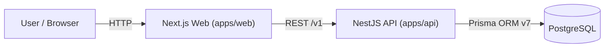

# Aurum


---

## Product Vision

Aurum is a privacy-first AI-powered personal finance assistant designed for intelligent monthly insights and long-term financial awareness.
It combines a modern ledger experience with analytics that make spending patterns understandable and actionable.
The product is web-first, with API-driven architecture and a clear path to AI-generated monthly reporting.
The long-term goal is to help users build consistent financial clarity without sacrificing data ownership.

---

## Architecture



---

## Progress & Roadmap

| Phase | Focus | Milestones | Status |
|------|-------|------------|--------|
| Phase 1 | Core Ledger & Analytics | M1–M4 | ✅ Completed |
| Phase 2 | AI Reports & Insights | M5–M6 | 🚧 In Progress |
| Phase 3 | Hardening & Scale | M7–M9 | ⏳ Planned |

### Phase 1 – Core Ledger (Completed)
- M1: Monorepo bootstrap
- M2: Database schema & migrations
- M3: Transactions CRUD
- M4: Analytics Dashboard (monthly summary + charts)

### Phase 2 – AI Layer (In Progress)
- M5.1: AI Monthly Report aggregation endpoint
- M5.2: AI Report UI page
- M6: LLM-powered insight generation (planned)

### Phase 3 – Engineering Hardening (Planned)
- Authentication & user isolation
- Caching layer for analytics
- Test coverage (unit + e2e)
- Observability & logging

---

## Current Capabilities

- Track transactions
- Categorize expenses
- View monthly cashflow
- View income vs expense charts
- View category breakdown
- Generate rule-based monthly AI report (if implemented)

---

## Upcoming Work

- LLM-based insight generation
- PDF export of monthly report
- Multi-month trend analysis
- User authentication

---

## Monorepo Structure

```text
Aurum/
|
|-- apps/
|   |-- web/          # Next.js frontend
|   `-- api/          # NestJS backend
|
|-- packages/
|   `-- core/         # shared types / utilities
|
|-- infra/
|   `-- docker/       # docker-compose.yml
|
|-- pnpm-workspace.yaml
|-- turbo.json
`-- package.json
```

---

## Quickstart

Prerequisites:

- Node.js 20.x
- pnpm 9.x
- Docker Desktop

Start local infrastructure:

```bash
docker compose -f infra/docker/docker-compose.yml up -d
```

Install and run:

```bash
pnpm install
pnpm dev
```

Quality checks:

```bash
pnpm lint
pnpm typecheck
```

---

## Database

Run migrations:

```bash
pnpm --filter api exec prisma migrate dev --name <migration-name>
```

Seed data:

```bash
pnpm --filter api exec prisma db seed
```

Open Prisma Studio:

```bash
pnpm --filter api exec prisma studio
```

---

## API Reference

Base URL: `http://localhost:3001`

| Endpoint | Method | Description |
| --- | --- | --- |
| `/v1/health` | GET | Health check |
| `/v1/categories` | GET | List categories for demo user |
| `/v1/accounts` | GET | List accounts for demo user |
| `/v1/transactions` | GET | List transactions with filters/pagination |
| `/v1/transactions/:id` | GET | Get transaction detail |
| `/v1/transactions` | POST | Create transaction |
| `/v1/transactions/:id` | PATCH | Update transaction |
| `/v1/transactions/:id` | DELETE | Delete transaction |
| `/v1/analytics/monthly-summary` | GET | Monthly summary analytics |
| `/v1/analytics/category-breakdown` | GET | Expense by category for month |
| `/v1/ai/monthly-report` | GET | Rule-based AI monthly report payload |

`GET /v1/transactions` query params:

- `limit`, `offset`
- `accountId`, `categoryId`
- `from`, `to`
- `include=refs` (optional; includes account/category refs)

---

## PowerShell curl Examples

```powershell
curl.exe "http://localhost:3001/v1/health"
curl.exe "http://localhost:3001/v1/analytics/monthly-summary?year=2026&month=2"
curl.exe "http://localhost:3001/v1/analytics/category-breakdown?year=2026&month=2"
curl.exe "http://localhost:3001/v1/ai/monthly-report?year=2026&month=2"
```

---

## Conventions

- Package manager: `pnpm`
- Monorepo task runner: `turbo`
- API prefix: `/v1`
- Use `.env` / `.env.local` for runtime configuration
- Keep shared cross-app logic under `packages/`
