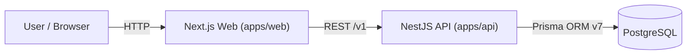

# Aurum


---

## Product Vision

Aurum is a privacy-first AI-powered personal finance assistant designed for intelligent monthly insights and long-term financial awareness.
It combines ledger operations, analytics, and explainable monthly reporting in a web-first architecture.
The system is built around API-owned business logic and typed frontend clients.
The near-term focus is to evolve from deterministic insights to a pluggable AI insight pipeline.

---

## Architecture



---

## Current Status

Aurum is currently at the end of Phase 2.
Core ledger, analytics dashboard, and AI report (rule-based insights) are complete.
Next step is extensible AI insight engine and LLM integration.

---

## Roadmap

### Phase 1 – Foundation
- M1: Monorepo setup
- M2: Database schema (Prisma v7)
- M3: Transactions CRUD
- M4: Analytics Dashboard  
Status: ✅ Completed

### Phase 2 – AI Report (Rule-Based)
- M5.1: AI Monthly Report API
- M5.2: AI Report UI
- M5.3: Loading / Error / Empty states
- Rule-based insights engine (baseline deterministic insights)  
Status: ✅ Completed

> Insights are currently generated via rule-based logic. LLM integration will be introduced in Phase 3.

### Phase 3 – Intelligent Insight Engine (Planned)
- M6.1: Pluggable Insight Engine abstraction
- M6.2: LLM-based insight generator
- M6.3: Hybrid (rules + LLM) merge strategy
- M6.4: Insight explanation + confidence scoring  
Status: 🚧 Planned

### Phase 4 – Hardening & Productization
- Authentication
- Multi-user isolation
- Caching layer
- PDF export of monthly reports
- Observability & logging  
Status: ⏳ Planned

---

## Current Capabilities

- Add transactions with categories
- Monthly summary analytics
- Income vs Expense visualization
- Category breakdown visualization
- AI Report page with rule-based insights
- Pluggable architecture prepared for future LLM integration

---

## AI Insight Architecture (Current)

Currently:  
Analytics -> Rule Engine -> Insights -> Web UI

Future:  
Analytics -> Rule Engine + LLM Engine -> Merge Layer -> Insights

Current implementation is deterministic and auditable.
Phase 3 introduces pluggable generation and merge logic without changing existing analytics contracts.

---

## Monorepo Structure

```text
apps/
  api/   (NestJS + Prisma v7)
  web/   (Next.js 14 App Router)
```

```text
Aurum/
|
|-- apps/
|   |-- web/
|   `-- api/
|
|-- packages/
|   `-- core/
|
|-- infra/
|   `-- docker/
|
|-- pnpm-workspace.yaml
|-- turbo.json
`-- package.json
```

---

## Quickstart

Prerequisites:

- Node.js 20.x
- pnpm 9.x
- Docker Desktop

Start local infrastructure:

```bash
docker compose -f infra/docker/docker-compose.yml up -d
```

Install and run:

```bash
pnpm install
pnpm dev
```

Quality checks:

```bash
pnpm lint
pnpm typecheck
```

---

## Database

Run migrations:

```bash
pnpm --filter api exec prisma migrate dev --name <migration-name>
```

Seed data:

```bash
pnpm --filter api exec prisma db seed
```

Open Prisma Studio:

```bash
pnpm --filter api exec prisma studio
```

---

## API Reference

Base URL: `http://localhost:3001`

| Endpoint | Method | Description |
| --- | --- | --- |
| `/v1/health` | GET | Health check |
| `/v1/categories` | GET | List categories for demo user |
| `/v1/accounts` | GET | List accounts for demo user |
| `/v1/transactions` | GET | List transactions with filters/pagination |
| `/v1/transactions/:id` | GET | Get transaction detail |
| `/v1/transactions` | POST | Create transaction |
| `/v1/transactions/:id` | PATCH | Update transaction |
| `/v1/transactions/:id` | DELETE | Delete transaction |
| `/v1/analytics/monthly-summary` | GET | Monthly summary analytics |
| `/v1/analytics/category-breakdown` | GET | Expense by category for month |
| `/v1/ai/monthly-report` | GET | Rule-based AI monthly report payload |

`GET /v1/transactions` query params:

- `limit`, `offset`
- `accountId`, `categoryId`
- `from`, `to`
- `include=refs` (optional; includes account/category refs)

---

## PowerShell curl Examples

```powershell
curl.exe "http://localhost:3001/v1/health"
curl.exe "http://localhost:3001/v1/analytics/monthly-summary?year=2026&month=2"
curl.exe "http://localhost:3001/v1/analytics/category-breakdown?year=2026&month=2"
curl.exe "http://localhost:3001/v1/ai/monthly-report?year=2026&month=2"
```

---

## Conventions

- Package manager: `pnpm`
- Monorepo task runner: `turbo`
- API prefix: `/v1`
- Use `.env` / `.env.local` for runtime configuration
- Keep shared cross-app logic under `packages/`
