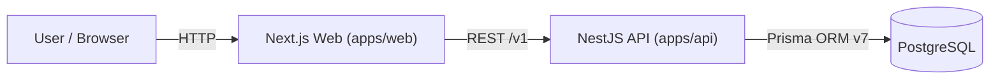

# Aurum


---

## Product Vision

Aurum is a privacy-first AI-powered personal finance assistant designed for intelligent monthly insights and long-term financial awareness.
It combines ledger operations, analytics, and explainable monthly reporting in a web-first architecture.
The system is built around API-owned business logic and typed frontend clients.
The near-term focus is to evolve from deterministic insights to a pluggable AI insight pipeline.

---

## Architecture


```mermaid
flowchart LR
  U["User / Browser"] -->|"HTTP"| WEB["Next.js Web (apps/web)"]
  WEB -->|"REST /v1"| API["NestJS API (apps/api)"]
  API -->|"Prisma ORM v7"| DB[("PostgreSQL")]
```

---

## Current Status

Aurum is currently in Phase 5.
Core ledger, analytics dashboard, AI report, auth/security, and Ledger v2 milestones are complete.
The next focus is production hardening (cookie-based auth/session security and deployment readiness).

---

## Roadmap

### Phase 1 - Foundation
- M1: Monorepo setup
- M2: Database schema (Prisma v7)
- M3: Transactions CRUD
- M4: Analytics Dashboard  
Status: ✅ Completed

### Phase 2 - AI Report (Rule-Based)
- M5.1: AI Monthly Report API
- M5.2: AI Report UI
- M5.3: Loading / Error / Empty states
- Rule-based insights engine (baseline deterministic insights)  
Status: ✅ Completed

> Insights are currently generated via rule-based logic. LLM integration is rolling out in Phase 3.

### Phase 3 - AI Insight Engine
- [x] M6.1 Pluggable Insight Engine abstraction
- [x] M6.2 OpenAI-compatible LLM scaffold
- [x] M6.3 Hybrid merge strategy (rules + LLM)
- [x] M6.4 Insight explanation + confidence scoring  
Status: ✅ Completed

### Phase 4 - Auth & Productization
- [x] M7.1 API Auth
- [x] M7.2 Web login/session
- [x] M7.3 Full userId isolation
- [x] M7.4 Auth security hardening (rotation/reuse detection/logout-all)
Status: ✅ Completed

### Phase 5 - Ledger v2
- [x] M8.1 Date-only occurredAt (Strategy A: API accepts/returns YYYY-MM-DD, DB remains DateTime)
- [x] M8.2 Income support
- [x] M8.3 Subcategory + custom create taxonomy
Status: ✅ Completed

### Milestone 8 Completion Notes
- Strategy A implemented: API accepts/returns date-only `YYYY-MM-DD`, while DB keeps `occurredAt` as `DateTime`.

---
## Current Capabilities

- Add transactions with categories
- Monthly summary analytics
- Income vs Expense visualization
- Category breakdown visualization
- AI Report page with rule-based insights
- Pluggable architecture with hybrid merge, explainability, and confidence scoring
- User-scoped category/subcategory taxonomy with in-flow create/select UX

---

## 🧠 AI Insight Architecture

```text
Client (Web)
   |
   v
AiController
   |
   v
AiService
   |
   v
INSIGHT_ENGINE (DI Token)
   |
   +--> RuleInsightEngine
   |
   +--> LLMInsightEngine
   |
   +--> HybridInsightEngine
              |
              +--> OpenAiCompatibleLlmClient
                      |
                      +--> OpenAI / vLLM (OpenAI-compatible API)
```

## ⚙️ Insight Modes

Aurum supports multiple insight generation modes:

| Mode | Description |
| --- | --- |
| `rules` | Deterministic rule-based insights (default, no AI required) |
| `llm` | Pure LLM-generated insights |
| `hybrid` | Rule insights + LLM augmentation |

Environment variables:

```bash
AURUM_INSIGHTS_MODE=rules|llm|hybrid
AURUM_LLM_ENABLED=true|false
AURUM_LLM_BASE_URL=http://localhost:8000
AURUM_LLM_MODEL=gpt-4.1-mini
```

---

## Monorepo Structure

```text
apps/
  api/   (NestJS + Prisma v7)
  web/   (Next.js 14 App Router)
```

```text
Aurum/
|
|-- apps/
|   |-- web/
|   `-- api/
|
|-- packages/
|   `-- core/
|
|-- infra/
|   `-- docker/
|
|-- pnpm-workspace.yaml
|-- turbo.json
`-- package.json
```

---

## Quickstart

Prerequisites:

- Node.js 20.x
- pnpm 9.x
- Docker Desktop

Start local infrastructure:

```bash
docker compose -f infra/docker/docker-compose.yml up -d
```

Install and run:

```bash
pnpm install
pnpm dev
```

Quality checks:

```bash
pnpm lint
pnpm typecheck
```

### Auth Flow

- Web: `http://localhost:3000`
- API: `http://localhost:3001`
- Auth routes (web): `/login`, `/register`
- Protected routes (web): `/transactions`, `/reports`, `/ai-report` (client-side `AuthGate`)
- Auth endpoints (api): `POST /v1/auth/register`, `POST /v1/auth/login`, `POST /v1/auth/refresh`
- Server-side user isolation: Accounts/Categories/Transactions/Analytics/AI enforce `userId` from JWT. Client never sends `userId`.
- Refresh token rotation enabled: `POST /v1/auth/refresh` returns `{ accessToken, refreshToken }` and revokes previous refresh token.
- Reuse detection enabled: using a revoked/expired refresh token triggers user-wide refresh session revocation.
- Session management: `POST /v1/auth/logout-all` revokes all refresh tokens for current user.
- Current web storage is `localStorage` (dev convenience). Future hardening target: `httpOnly` secure cookies.

### AI (optional)

By default, AI is disabled.
To test LLM mode:

- Set `AURUM_LLM_ENABLED=true`
- Set `AURUM_INSIGHTS_MODE=llm` or `AURUM_INSIGHTS_MODE=hybrid`
- Provide `AURUM_LLM_BASE_URL` and `AURUM_LLM_MODEL`

If no LLM server is running, the system safely falls back.

---

## Database

Run migrations:

```bash
pnpm --filter api exec prisma migrate dev --name <migration-name>
```

Seed data:

```bash
pnpm --filter api exec prisma db seed
```

Open Prisma Studio:

```bash
pnpm --filter api exec prisma studio
```

---

## API Reference

Base URL: `http://localhost:3001`

| Endpoint | Method | Description |
| --- | --- | --- |
| `/v1/health` | GET | Health check |
| `/v1/categories` | GET | List categories for current user |
| `/v1/categories` | POST | Create category (user-scoped, unique per user) |
| `/v1/subcategories` | GET | List subcategories by categoryId (user-scoped) |
| `/v1/subcategories` | POST | Create subcategory under category (user-scoped) |
| `/v1/accounts` | GET | List accounts for current user |
| `/v1/transactions` | GET | List transactions with filters/pagination |
| `/v1/transactions/:id` | GET | Get transaction detail |
| `/v1/transactions` | POST | Create transaction |
| `/v1/transactions/:id` | PATCH | Update transaction |
| `/v1/transactions/:id` | DELETE | Delete transaction |
| `/v1/analytics/monthly-summary` | GET | Monthly summary analytics |
| `/v1/analytics/category-breakdown` | GET | Expense by category for month |
| `/v1/ai/monthly-report` | GET | Rule-based AI monthly report payload |

`GET /v1/transactions` query params:

- `limit`, `offset`
- `accountId`, `categoryId`
- `from`, `to`
- `include=refs` (optional; includes account/category refs)

---

## PowerShell curl Examples

```powershell
curl.exe "http://localhost:3001/v1/health"
curl.exe "http://localhost:3001/v1/analytics/monthly-summary?year=2026&month=2"
curl.exe "http://localhost:3001/v1/analytics/category-breakdown?year=2026&month=2"
curl.exe "http://localhost:3001/v1/ai/monthly-report?year=2026&month=2"
```

---

## Conventions

- Package manager: `pnpm`
- Monorepo task runner: `turbo`
- API prefix: `/v1`
- Use `.env` / `.env.local` for runtime configuration
- Keep shared cross-app logic under `packages/`
